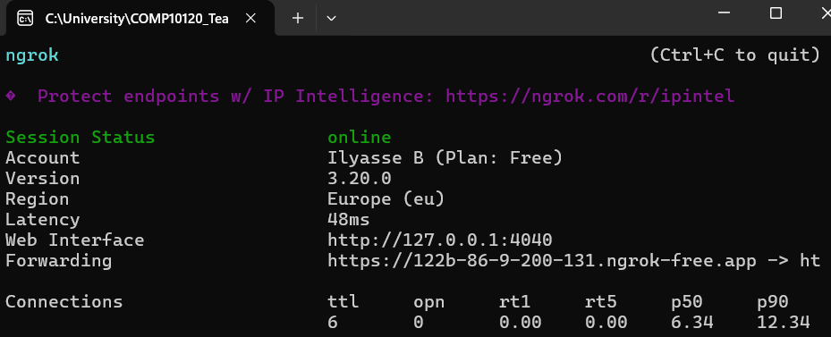
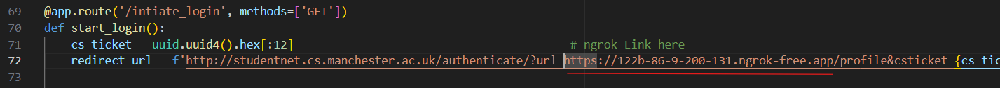

# How to run Thrifty Bee:

## Running React (front-end)
First you need to seperately run the React app.
You must have node.js installed on your device.
Open the terminal in the x4-team-project/front-end directory

Run:
> npm install

After installing required packages, run:
> npm start

## Running ngrok
Now you need to download the ngrok client, it's really simple and lightweight.
Follow the steps below:
[Get started with ngrok](https://dashboard.ngrok.com/get-started/setup)

Then open the ngrok application, and configure your authtoken using the command provided on your ngrok dashboard online

Then run this command:

> ngrok http http://localhost:3000

You should then see something like this:

Copy the forwarding link.

Go into app.py, line 72.
Replace only the URL substring with with your forwarding link as such:

## Running flask (back-end)
Open the terminal.

Navigate to x4-team-project/server

Install required flask & database packages (Requires Python):

> pip install flask
> pip install flask-cors
> pip install flask-migrate
> pip install flask-sqlalchemy
> pip install sqlalchemy
> pip install psycopg2

Now run:

> flask db init
> flask db migrate
> flask db upgrade
> flask run

## Opening the web app
Now that all parts of the web app are running locally, and your connection to our server-hosted database is running, you can now run the app in your browser:

Follow the forwarding link from ngrok in your browser

You have now completed all steps to running Thrifty Bee

# Logging In
Clicking the Log-in button wil re-direct you to the university's sign in page. Enter your university details as usual

We only store your username, name, and a "csTicket" used to identify successfully authorised log ins from the CAS authentication system