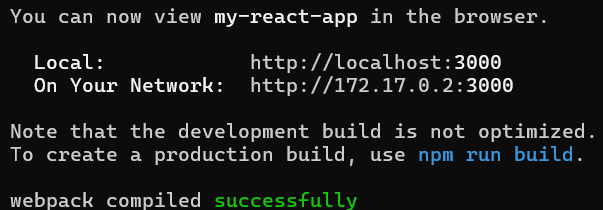

# Getting Started with Create React App

This project was bootstrapped with [Create React App](https://github.com/facebook/create-react-app).

# Install node.js & run app locally

[Install Node.js](https://nodejs.org/en/download)

Run

> npm install

within the x4-team-project directory in the terminal.

Then run

> npm start

to start the app locally. Follow the link provided (localhost:3000) to test the app.

## Available Scripts

In the project directory, you can run:

### `npm start`

Runs the app in the development mode.\
Open [http://localhost:3000](http://localhost:3000) to view it in your browser.

The page will reload when you make changes.\
You may also see any lint errors in the console.

### `npm test`

Launches the test runner in the interactive watch mode.\
See the section about [running tests](https://facebook.github.io/create-react-app/docs/running-tests) for more information.

### `npm run build`

Builds the app for production to the `build` folder.\
It correctly bundles React in production mode and optimizes the build for the best performance.

The build is minified and the filenames include the hashes.\
Your app is ready to be deployed!

See the section about [deployment](https://facebook.github.io/create-react-app/docs/deployment) for more information.

# How to build the React app with docker

**You should only use docker for running the app after major changes have been made**

**Otherwise, follow the instructions above for running the React app locally**

Follow instructions for installing Docker on Windows:

[Install Docker for Windows](https://docs.docker.com/desktop/setup/install/windows-install/)

Once installed, open the directory "x4-team-project" in the terminal.

Build an image of the environment using:

> docker build -t react-app .

Include the "." at the end

After this has completed, run a container using this image with:

> docker run -it --name running-app -it -p 3000:3000 react-app

Output should look something like this:

Now open your browser, and enter

> localhost:3000

into the address bar, and the app should display correctly.

### `npm run eject`

**Note: this is a one-way operation. Once you `eject`, you can't go back!**

If you aren't satisfied with the build tool and configuration choices, you can `eject` at any time. This command will remove the single build dependency from your project.

Instead, it will copy all the configuration files and the transitive dependencies (webpack, Babel, ESLint, etc) right into your project so you have full control over them. All of the commands except `eject` will still work, but they will point to the copied scripts so you can tweak them. At this point you're on your own.

You don't have to ever use `eject`. The curated feature set is suitable for small and middle deployments, and you shouldn't feel obligated to use this feature. However we understand that this tool wouldn't be useful if you couldn't customize it when you are ready for it.

## Learn More

You can learn more in the [Create React App documentation](https://facebook.github.io/create-react-app/docs/getting-started).

To learn React, check out the [React documentation](https://reactjs.org/).

### Code Splitting

This section has moved here: [https://facebook.github.io/create-react-app/docs/code-splitting](https://facebook.github.io/create-react-app/docs/code-splitting)

### Analyzing the Bundle Size

This section has moved here: [https://facebook.github.io/create-react-app/docs/analyzing-the-bundle-size](https://facebook.github.io/create-react-app/docs/analyzing-the-bundle-size)

### Making a Progressive Web App

This section has moved here: [https://facebook.github.io/create-react-app/docs/making-a-progressive-web-app](https://facebook.github.io/create-react-app/docs/making-a-progressive-web-app)

### Advanced Configuration

This section has moved here: [https://facebook.github.io/create-react-app/docs/advanced-configuration](https://facebook.github.io/create-react-app/docs/advanced-configuration)

### Deployment

This section has moved here: [https://facebook.github.io/create-react-app/docs/deployment](https://facebook.github.io/create-react-app/docs/deployment)

### `npm run build` fails to minify

This section has moved here: [https://facebook.github.io/create-react-app/docs/troubleshooting#npm-run-build-fails-to-minify](https://facebook.github.io/create-react-app/docs/troubleshooting#npm-run-build-fails-to-minify)

# Authorisation and Authentication:

## STEPS WITH EXPLANATION:

### REDIRECT INITIATION: We generate an alpahanumeric code called a csticket from our flask serverand construct a redirect url according to this from http://studentnet.cs.manchester.ac.uk/authenticate/?url=https://7b95-31-205-0-5.ngrok-free.app/profile&csticket=CSTICKET&version=3&command=validate (First Part of URL till the ? refrences uoms authentication link
### the question mark means the query parameters begin; each query parameter has a key and value of the from key=value.
### The url query parameter that is referenced is our site profile page because that is where we want the user to go after thry login
### )

### REDIRECT USER:If you look at Profile.js you will see this line of code window.location = redirect_url this is where we redirect the user to the link we constructed in our backend.

### CONFIRM THE USER'S CREDENTIALS: We send a request to our flask backend making sure we include the user data we have of the user; to see how this is implemented look at Profile.js and you will see and look at the commenting(we can only have data of a user via query parameters or by session data). Our Flask backend then checks our tansfers our user data to the uoms api and basically asks it are these credentials that of a user that has logged in and has an active session, if not our backend returns a 401; and this is why if you look at protected components you will see we check for this status code and re route them to the home page

## HOW TO SET UP FOR DEVELOPMENT:

### Step1:
#### You have to setup ngrok. It is very easy just search up ngrok.com make an account and then follow the immediate instructions they give you on how to map a local port a public url
### Step2:
#### Run the React app: npm install | npm start

### Step3:
#### React app should be running on port 3000 so then run the ngrok command to map port 3000 to a public url. It should be something like ngrok http 3000

### Step4:
#### Paste in the public url that ngrok gives you into your browser- it should look like https://7b95-31-205-0-5.ngrok-free.app

### Step5:
### replace the the part of the url from right after the '=' that comes before 'url' till right before '/profile' with the url that ngrok gave you so the url given the variable name 'redirect_url' should look like this:
### 'http://studentnet.cs.manchester.ac.uk/authenticate/?url=[YOUR URL FROM NGROK]/profile&csticket={cs_ticket}&version=3&command=validate'

## Please Communicate if there be any issue with the authorisation and authentication described above!

