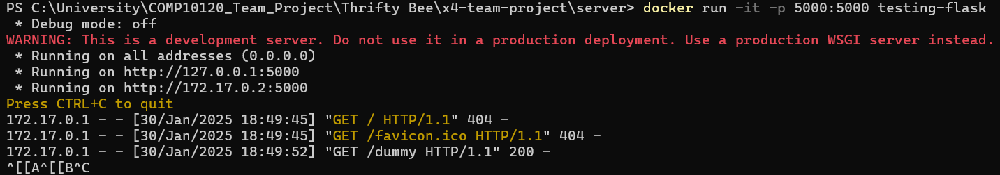

# Back-end branch

# Instructions on how to build the app using Docker
Install docker:
[Install for Windows](https://docs.docker.com/desktop/setup/install/windows-install/)

After you have installed docker, open the "server" folder in the terminal.

Build the image using:

> docker build -t run-flask .

Include the "." at the end

After this has completed, run a container using this image with the command:

> docker run -it --name flask-app -p 5000:5000 run-flask

The container should then run, and the app should start:

Then, open your browser. Type in:

localhost:5000

into the address bar. The app should be displayed.

To end the container process, use Ctrl + C in the terminal

# Creating environment variable for app secret:
## run npm install dotenv
## make a .env file
## load the